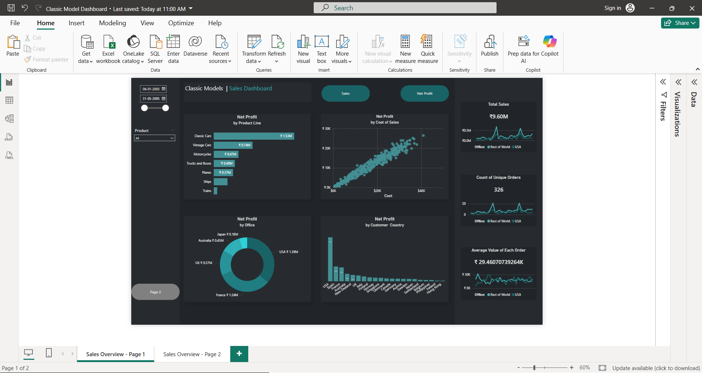
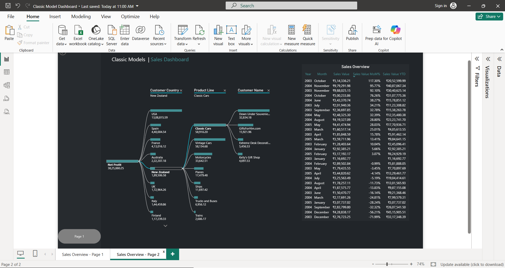

# 📊 Classic Model Dashboard (Power BI)

## 📌 Overview
This project is a Power BI dashboard built using a classic data model approach. It presents key insights through interactive visuals and allows users to navigate between multiple pages.

## ✨ Features
- Interactive dashboard with clean layout
- Page navigation using buttons
- Data visualization using charts and KPIs
- Organized structure for better analysis

## 🧰 Tools Used
- Power BI
- Data Modeling

## 📊 Dashboard Preview

### 🔹 Page 1

### 🔹 Page 2

## 🚀 How to Use
1. Download the `.pbix` file  
2. Open it in Power BI Desktop  
3. Use buttons to navigate between pages  

## 📚 Learning Outcome
- Learned how to build a multi-page dashboard  
- Understood navigation using buttons  
- Improved skills in data visualization  

## 📌 Note
This is a beginner-level project created for learning and practice.
